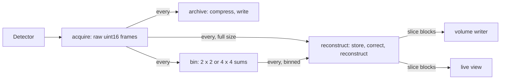

# Next: a pipeline for full-size detectors

Status: **plan, written 2026-10-08. Nothing in it is built.** The pipeline described in
[README.md](README.md) is the prototype this replaces. Transport terms are those of tango-ucx's
`CONTEXT.md`; what this plan asks of the transport is in tango-ucx, `docs/tomography-pipeline.md`.

## The target

| | |
|---|---|
| Detector frame | 2048 × 2048 uint16 or larger: 8 MiB |
| Frame rate | about 240 frames/s: 1.875 GiB/s, 16.1 Gbit/s |
| Scan | about 2000 projections, 50 flats and 50 darks, all configurable: 2100 frames, 16.4 GiB, 8.75 s |
| Corrected float32 projections | 31.25 GiB |
| Reconstructed float32 volume | 32 GiB |
| Hardware | an L40 (48 GB) for reconstruction, perhaps an L4 (24 GB) where the frames arrive |

The detector's frames are compressed and written to disk where they arrive. The live pipeline
receives them uncompressed, so it has no decompression stage.

## What was measured, and what is estimated

Measured on the development machine, one RTX 2060 SUPER (8 GB), with
[benchmarks/target_scale_probe.py](benchmarks/target_scale_probe.py) and
[benchmarks/compression_probe.py](benchmarks/compression_probe.py). Nothing was measured on an
L4 or an L40.

| Measured on the 2060 SUPER | Result | Needed |
|---|---|---|
| `fbp_gpu`, 2000 angles × 2048 columns | 69 ms per slice, 141 s per volume | 8.75 s |
| The same, 2 × 2 binned (1024 columns, 1024 slices) | 17.6 ms per slice, 18 s per volume | 8.75 s |
| The same, 4 × 4 binned (512 columns, 512 slices) | 5.6 ms per slice, 2.9 s per volume | 8.75 s |
| Share of the full-size slice time spent filtering | 4.6 of 69 ms; the rest is ASTRA backprojection | |
| Dark/flat/−log kernel on 2048 × 2048 frames | about 6,000 frames/s | 240 |
| 2 × 2 sum binning | about 5,000 frames/s | 240 |
| Copy a 16-frame batch into a raw scan store | about 170 GiB/s | 1.875 |
| Gather 64 detector rows of every projection from that store | about 90 GiB/s | |
| nvCOMP LZ4, every variant tried, on synthetic noisy frames | 0.2 to 1.3 GiB/s, ratio 1.0 | 1.875 |
| nvCOMP Bitcomp, `data_type="<u2"`, same frames | 21 GiB/s, ratio 1.53 | 1.875 |

Three things follow, and they hold on any card:

1. **Reconstruction is the limit.** Per-frame work has more than ten times the margin it needs.
2. **The limit is backprojection**, whose cost grows with angles × voxels. Binning 2 × 2 divides
   it by about eight.
3. **LZ4 is the wrong codec for these frames.** It is too slow and does not shrink noisy uint16
   data. The ratio must be measured again on real detector frames.

Estimates for the cards scale the 2060 SUPER figures by three published ratios: memory
bandwidth (L4 0.67×, L40 1.9×), a Geekbench OpenCL score (L4 1.6×, L40 about 3.3× using the
RTX 6000 Ada's; the scores come from different reviews), and rated FP32 throughput (L4 4.2×,
L40 12.6×).

| Estimated, current backend | L4 | L40 |
|---|---|---|
| Full-size volume | 34 to 210 s | 11 to 74 s |
| 2 × 2 binned volume | 4 to 25 s | 1.4 to 9 s |

A full-size volume misses the 8.75 s scan on the L40 under every ratio. A binned volume very
probably fits on the L40 and probably does not on the L4.

The TomocuPy paper ([J. Synchrotron Rad. 2023](https://pmc.ncbi.nlm.nih.gov/articles/PMC9814072))
reports a 2048³ volume from 2048 angles, disk read and write included, in 4.4 s on an A100 with
its Fourier method (float32), in 8.1 s with direct backprojection, and in 4.8 s on a Quadro RTX
4000 (float16), a card of the 2060 SUPER's class. Those figures were not reproduced here. If
they hold, the backend matters far more than the card, and a full-size volume fits inside a
scan on the L40.

## What does not carry over from the prototype

| Prototype | At the target size |
|---|---|
| The reconstruction device keeps the whole float32 sinogram and a whole volume on its GPU | 63 GiB on a 48 GB card |
| A correction device publishes float32 projections to the reconstruction device | A 3.75 GiB/s UCX stream between two processes for a kernel with 25 times the margin |
| The worker reconstructs inside `consume`, so it reads nothing meanwhile | The transport still receives into the ring, but the launcher caps a ring at 512 MiB: 64 frames, 0.27 s |
| A slow stage applies pressure back to the source | A detector cannot be held |
| One dark and one flat per scan, before the projections | 50 of each, and flats may follow the projections |
| A whole volume is one frame | A frame is at most 2 GiB: 128 slices of 2048 × 2048 |
| The GPU, its memory and the batch sizes are launch flags a person chooses | The same pipeline must run on 8, 24 and 48 GB cards, and on detectors larger than 2048 |

## The pipeline

### Work goes where it scales

There are two kinds of work. **Per-frame** work touches each pixel once: receive, bin,
compress, store, correct. **Per-volume** work is reconstruction. A small card does all the
per-frame work of a 240 frames/s detector with room to spare; only reconstruction needs the
large one. So the roles are separate Tango devices, and where each runs is a launch setting:
all on one GPU, on two GPUs in one host, or on two nodes.

The reconstruction device subscribes to one of the two streams, whichever the plan below
selects.

| Device | Runs on | Does |
|---|---|---|
| `acquire` | Ingest GPU | Publishes each detector frame as it arrives: an array stream of uint16, with the application fields the prototype already uses (kind, projection, angle, scan and calibration identity). For tests, a source that replays a file at a set frame rate |
| `archive` | Ingest GPU | An every subscriber. Compresses on the GPU and writes. It is the only subscriber allowed to apply pressure to `acquire`: if the archive cannot keep up, acquisition must stop |
| `bin` | Ingest GPU | Sums 2 × 2 or 4 × 4 raw pixels and publishes uint32. Darks and flats are binned the same way, so correction is unchanged. Binning counts before the logarithm is the physically correct order |
| `reconstruct` | Reconstruction GPU | Stores the raw scan, averages darks and flats, corrects and reconstructs a slab of slices at a time, publishes slice blocks |
| writer, viewer | Host | As now, assembling blocks with `output_blocks.py` |

The decompression device, the correction device and the float32 projection stream go away.

### The reconstruction device

**A raw scan store.** Frames are kept as they arrive: projection-major, in the detector's
dtype. One receive batch is one contiguous copy into the store. Darks and flats are added
into two float32 sums as they arrive, in any number and any order, and divided when the scan
ends. Nothing is corrected on arrival. A scan in the store is half the size of its float32
form, and flats taken after the projections cost nothing extra.

**Slabs.** Parallel-beam slices are independent: slice `z` needs detector row `z` of every
projection. For each slab of `B` rows the device

1. gathers `store[:, r0:r1, :]` into a `(B, angles, columns)` array, one strided copy,
2. applies dark, flat and −log into float32,
3. filters and backprojects into a publisher slot,
4. publishes the block with its slice range, as `--output-mode blocks` does today.

GPU memory is then the stores plus a workspace that depends on `B` and not on the detector's
height. The whole volume never exists on the GPU.

**Two stores, two threads.** An ingest thread owns the subscription and the store being
filled. A reconstruction thread owns the store being read. They exchange stores at a scan
boundary, each on its own CUDA stream.

| Store state | Owner | Leaves when |
|---|---|---|
| free | none | a scan begins |
| filling | ingest thread | the scan's last frame is copied and its event recorded |
| ready | none | the reconstruction thread is idle |
| reconstructing | reconstruction thread | the last block is published |

This buys one scan of slack, and it means the ingest thread always reads. It does not add
capacity: if a volume takes longer than a scan, both stores are full one scan later. So the
device needs a rule for a scan that begins with no free store:

- `skip` (a detector): read the scan's frames and discard them, count the scan as skipped,
  and never apply pressure to `acquire`. The archive still has the scan.
- `hold` (a replayed file): stop reading and let pressure hold the source.

The ownership rules are those of the earlier experiment, which already ran this shape on a
generated copy of the device (`perf-audit/SCAN-OVERLAP-FOLLOWUP.md`, kept outside this
repository): the receive view lives until its last queued read, a per-store event orders
reconstruction after ingest, and a store is reused only after its last block is published.
At the prototype's size that experiment gained 3.6 to 3.8%, inside the run-to-run variation.
The reason to build it now is the skip rule, not speed.

### The plan: fit the pipeline to the hardware

Today a person picks GPU numbers, batch sizes, memory locations and budgets. At this size a
wrong choice fails in the middle of a scan. A plan is computed once, at Arm, from what the
hardware is measured to do, and refused there if nothing fits.

**Inputs.**

- The scan: rows, columns, projections, darks, flats, element type, frame rate, and the gap
  between scans.
- Per GPU: free memory, and the seconds per slice of each reconstruction backend at this
  geometry and at each binning, measured on four slices as `target_scale_probe.py` does.
- The host: free and lockable memory.
- The output: what the writer can sustain, in bytes per second.

**Rules, in order.**

| # | Chooses | Rule |
|---|---|---|
| 1 | Live binning `b` | The smallest of 1, 2, 4 whose volume time, `rows / b` × seconds per slice at `b`, is under 80% of the scan period plus the gap |
| 2 | Backend | The fastest backend that has a verified reference at this geometry |
| 3 | Output block rows | At most `2 GiB / (4 × columns²)` slices, the transport's frame limit |
| 4 | Slab rows `B` | The largest whose gather, float32 slab, filter scratch and output slots fit the GPU memory left after rule 5 |
| 5 | Store location | Two stores on the GPU if they and the workspace fit in 85% of its free memory. Otherwise one on the GPU and one in pinned host memory, uploaded when the GPU store frees. Otherwise both on the host, uploaded a slab at a time, as `--sinogram-memory host` does now |
| 6 | Full size, when `b` is above 1 | Every `k`-th scan at full size on a second reconstruction device, with `k` the full-size volume time over the scan period, rounded up; or from the archive afterwards |
| 7 | Output dtype | float32, or float16 when the writer cannot sustain float32 |
| 8 | Link budgets | Each ring holds at least one second of frames. The 512 MiB and 1024-frame caps in `pipeline_control.py` go |

The plan is written to `scan.json` and reported by the device, as `buffering.memory_plan` is
now, with the measurement behind each choice.

**What the plan gives for the 2048 × 2048, 2000-projection scan.** Only the first row uses
measurements; the others use the estimates above and will change.

| Hardware | Live volume | Store | Full size |
|---|---|---|---|
| One 2060 SUPER, current backend | 4 × 4 binned, 512³, 2.9 s | Two binned stores on the GPU, 3.9 GiB | From the archive; 141 s each |
| One L40, current backend | 2 × 2 binned, 1024³, about 5 s | Two binned stores on the GPU, 15.6 GiB | Every fifth scan or so, or from the archive |
| L4 and L40, current backend | The same; binning and archive move to the L4 | The same | The same |
| L40, Fourier backend, if the published figures hold | Full size, 3 to 5 s | Two raw stores on the GPU, 31.3 GiB of about 38 GiB used | Live |
| A detector larger than 2048 on an L40 | As measured | One store on the GPU, one on the host | As measured |

### The reconstruction backend

In order of what each could gain:

1. **A Fourier method.** TomocuPy's `FourierRec.backprojection(obj, data, stream)` takes a
   `(slices, angles, columns)` CuPy array and fills `(slices, columns, columns)` on a given
   stream: the layouts used here. Filtering stays ours. It needs building against CUDA 12.9,
   its own verification reference, and a check of its centre, scaling and padding conventions.
   It may need an even number of slices per call.
2. **Persistent native ASTRA backprojection.** The audit measured 1.72 times on isolated
   reconstruction at 512 columns by removing per-slice allocations. At 2048 columns the
   kernels are a larger share of the time, so expect less. It depends on a private ASTRA ABI.
3. **More GPUs.** Slabs are independent, so one scan can be split across reconstruction
   devices by slice range, or whole scans can go to a pull set as `--reconstructors` does.

SIRT stays available for small volumes. At this size it is not a live method.

### Output

A full-size float32 volume every 8.75 s is 3.7 GiB/s, about twice what the detector
produces. Once reconstruction keeps up, the writer is the next limit. The writer becomes a
bounded queue of blocks with its sustained rate measured and given to the plan. Comparing
every volume with an independent reference, as the demo does, is not possible at this rate;
verification becomes a named policy: every volume at small sizes, sampled slices at full size.

## Build order

Each step is measured before the next begins.

| # | Step | Done when |
|---|---|---|
| 0 | Run both probes on the L4 and the L40, and the compression probe on real detector frames | The estimate tables above are replaced by measurements |
| 1 | Try the Fourier backend at 2000 × 2048 on the 2060 SUPER, outside the pipeline | Seconds per slice beside ASTRA's on the same card, and a reference comparison that says how the two differ |
| 2 | A raw source that replays at a set frame rate, with any number of darks and flats | The prototype's volumes still match their references with 50 darks and 50 flats averaged |
| 3 | The fused reconstruction device: raw store, deferred correction, slab loop, block output only, one store, one thread | Verified volumes at the prototype's sizes; GPU memory measured not to grow with detector rows |
| 4 | The plan, computed at Arm from measured rates, with the host store | Unit tests for each row of the table above; an impossible scan is refused at Arm |
| 5 | Two stores, the ingest thread, `skip` and `hold` | With reconstruction made slower than the scan, `acquire` reports no pressure, skipped scans are counted, the archive is complete |
| 6 | The `bin` device and the live binned path | A binned volume for every scan at 240 frames/s on the target card |
| 7 | The archive on the ingest GPU, with the chosen codec, and GPUDirect Storage where the node supports it | The archive keeps pace for a thousand scans and reads back exactly |
| 8 | The block writer and the verification policy | Sustained output measured; no unbounded queue |
| 9 | Two nodes | `UCX_PROTO_INFO=y` shows no fragmented copy of GPU memory on any link, at the target frame size and rate |
| 10 | A second reconstruction GPU | Full-size volumes per second rise with the second card |

Steps 0 and 1 decide the rest: whether full size is live on one L40, and which backend steps
3 to 6 are built around.

## Decisions to take

| Decision | Why it matters |
|---|---|
| Are scans back to back, or is there a gap? | The gap is in rule 1. Tens of seconds of gap make full size live even on the current backend |
| One chassis or two nodes, and which network card? | GPU to GPU inside one host is measured (CUDA IPC, one device copy per frame). Between nodes nothing is measured, and the local UCX build has no `rc` or `gdr_copy`. Full-size frames need 25 GbE or more; 2 × 2 binned uint32 frames are 8 Gbit/s, which leaves 10 GbE little room |
| The archive's format | Bitcomp is fast and is read only by nvCOMP. Bitshuffle-LZ4 on CPU threads is what HDF5 tools read |
| Where volumes go, and in which dtype | 32 GiB each; see Output |
| How frames reach the ingest node | A frame grabber fills host memory, which wants a pinned upload. A network detector could be received straight into GPU memory |

## Not in this plan

- Fan-beam or cone-beam geometry. Slabs are independent only for parallel beam.
- Rotation-centre search, stripe removal and phase retrieval. Each is a per-slab step between
  correction and filtering, and the slab loop leaves room for them.
- Anything that lowers the science to gain speed without saying so: fewer angles, fewer
  iterations, a looser tolerance.
