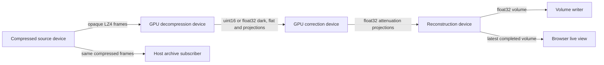

# GPU tomography pipeline

Four ordinary Tango device server processes use the installed tango-ucx package to move
a compressed detector scan through GPU decompression, correction and selectable reconstruction.
An independent subscriber archives the original compressed frames while processing runs.
The same processes can replay scans continuously and serve a live browser view.



Each arrow is a separate UCX subscription discovered through Tango. The source has two
`every` subscribers. Both join before acquisition starts and both apply pressure:
a slow archive or processing stage can hold the source. The archive stores the received
compressed bytes without decoding or recompressing them. It also stores frame indices,
timestamps, lengths, projection angles, scan identity and calibration identity.

## Run

Use a Linux NVIDIA GPU with a CUDA 12.9 compatible driver and Pixi. From the examples
project root, build and install the sibling library, then run the demo:

```sh
./build_local.sh
pixi run tomography --output results/tomography
```

The examples' Pixi environment adds CuPy, NVIDIA nvCOMP, CUDA ASTRA, TomoPy and LZ4. Its Python
version matches the installed tango-ucx extension. The C++ example uses `find_package`
against `stage/`; it includes public headers only. `--output` must name a new directory.
Without it, the demo uses temporary files and removes them after verification.

The default scan has 96 projections and reconstructs an 8 × 64 × 64 volume with
40 SIRT iterations. The demo launches the four servers on local ports, arms every link,
waits for the archive subscriber, starts downstream first and waits for end of stream.
It writes `volume.npy`, `reconstruction.png`, `summary.json`, server logs and an `archive/`
directory containing `payloads.bin`, `records.jsonl` and the stream description.

### Select GPU placement and transport

`--network tcp|auto|rdma` (`--profile` is an alias) selects UCX policy before importing
the transport or launching any servers. The default `tcp` profile uses
`tcp,cuda_copy,self` and loopback, retaining the local demonstration. `auto` uses
`all`, allowing UCX to select CUDA IPC or an available network transport. `rdma`
uses `rc,cuda` and disables the processing subscriptions' GPU-over-TCP opt-in.
`--net-devices` selects an interface or HCA and port. Existing UCX device selection
is preserved when that flag is omitted; with no configured interface, TCP uses `lo`
and the other profiles leave selection to UCX. Additional UCX settings, including
`UCX_PROTO_INFO=y`, are inherited by the launcher and all child processes.

`--gpu N` selects the GPU for synthetic scan preparation and the default GPU for
each processing stage. `--decompress-gpu`, `--correct-gpu` and `--reconstruct-gpu`
override individual stages, so UCX can transfer between different GPUs. The
independent reconstruction reference uses the reconstruction stage's GPU. Indices
are logical device numbers within the inherited `CUDA_VISIBLE_DEVICES`. Placement
and network policy are launch settings; reconstruction controls remain live.

```sh
# Let UCX select a local GPU path, with reconstruction on a second GPU.
pixi run tomography-live --network auto --algorithm sirt \
  --decompress-gpu 0 --correct-gpu 0 --reconstruct-gpu 1 \
  --output results/live-two-gpus

# Exercise the RDMA profile on a machine with a suitable HCA.
UCX_PROTO_INFO=y pixi run tomography-live --network rdma --net-devices mlx5_0:1 \
  --algorithm sirt --output results/live-rdma
```

GPU processing writes directly into publisher slots and reads borrowed receive
buffers. UCX can avoid host payload staging with suitable CUDA IPC/peer access or
GPUDirect RDMA support. Automatic selection permits staging; the RDMA profile
excludes TCP but does not certify GPUDirect. Confirm the path with UCX protocol
output and CUDA traces on the target hardware. See
[UCX GPU transport requirements](https://openucx.readthedocs.io/en/master/faq.html#working-with-gpu).
This launcher still starts all devices on one machine; use the examples project's
separate-node launchers to exercise inter-node GPU transport. The source archive,
volume writer and browser viewer use host memory, and GridRec stages its
reconstruction through the CPU. Select SIRT or FBP for GPU reconstruction.

`workload.network` and `workload.stage_gpus` record the selected policy and placement
in status and summary reports. `devices.json` records each processing device's GPU.
The live dashboard shows GPU placement and each processing link's reported UCX
transport. A transport name describes the negotiated connection; it does not
establish that every payload avoided staging.

## Use an HDF5 detector scan

Pass `--hdf5 FILE` to replay measured detector images instead of generating a phantom.
The defaults match the Data Exchange layout used in the
[TomoPy reconstruction example](https://tomopy.readthedocs.io/en/stable/ipynb/tomopy.html):

| Dataset | Shape / meaning |
| --- | --- |
| `/exchange/data` | `(projections, detector rows, detector columns)`, raw counts |
| `/exchange/data_white` | `(flat images, rows, columns)` or one `(rows, columns)` flat |
| `/exchange/data_dark` | `(dark images, rows, columns)` or one `(rows, columns)` dark |
| `/exchange/theta` | One angle per projection |

HDF5 reading needs the optional `h5py` dependency. From the examples project root,
install it once and then launch with a local file (the launcher does not download data):

```sh
pixi add h5py
pixi run tomography --hdf5 /path/to/tooth.h5 --sino 0:2 --algorithm gridrec \
  --output results/tooth
```

For environments managed with pip, install `tomography/requirements-hdf5.txt` alongside
the existing demo dependencies. HDF5 input remains optional for phantom runs.

`--sino START:STOP[:STEP]` selects detector rows, like the example's `sino=(0, 2)`.
`--proj START:STOP[:STEP]` selects projections and their matching angles. Bounds are
zero-based, stop is exclusive, and step must be positive. Omitted bounds select the
remaining extent; omitted selections use the whole dataset. Dimensions come from
the selected input: `--pixels`, `--slices` and `--angles` cannot be combined with
`--hdf5`. Stress presets still set receive budget and scan timing when using a file.

Use `--data-path`, `--flat-path`, `--dark-path` and `--theta-path` for other dataset
locations. Angle units default to the theta dataset's `units` attribute, or degrees
when it has no attribute, following the
[DXchange APS reader](https://dxchange.readthedocs.io/en/latest/_modules/dxchange/exchange.html#read_aps_tomoscan_hdf5).
Override with `--theta-units degrees` or `--theta-units radians`. If the default
`/exchange/theta` dataset is absent, the loader generates equally spaced angles
from 0 through 180 degrees for the original projection count, then applies `--proj`.
A missing custom theta path is an error. Acquisition rotation metadata is not read.

```sh
pixi run tomography-live --hdf5 /path/to/scan.h5 --sino 100:108 \
  --proj 0:1800:2 --theta-units degrees --center 304.5 \
  --output results/measured-live
```

The projection dataset must contain raw detector counts. Fractional counts, such
as averaged or downsampled measurements, are supported. Projection and calibration
counts must be finite, nonnegative and representable in float32. Normalized
transmission or attenuation arrays need separate preprocessing; the loader assumes
detector counts and always performs dark/flat correction and `-log`.

The detector stream uses uint16 when the projection dataset is an integer type of
at most 16 bits and both calibration maps contain integral counts in `[0, 65535]`.
Otherwise it uses float32 for dark, flat and projections, preserving fractional
counts without integer rounding. Float64 inputs and wider integers are converted
to float32, which can lose precision. Calibration stacks are averaged in float64
before conversion to the stream dtype; single calibration images are converted
directly. Flat must exceed dark at every selected pixel after conversion.
The current stream carries one dark and one flat image per scan. Calibration drift,
per-projection flats, invalid-pixel masks and other HDF5 layouts such as NeXus
image-key datasets need separate preprocessing.

Each selected projection is read and compressed individually as a raw LZ4 block;
the original HDF5 compression is not forwarded. The correction reference is computed
from those same counts with NumPy float64 using `(raw-dark)/(flat-dark)`, clipping
transmission to `[1e-6, 1]` and taking `-log`. The selected corrected sinogram and
reconstructed volume must still fit memory. All archive, stage-count, finite-value
and reconstruction-reference checks remain active. There is no known phantom for
measured data, so phantom error fields are `null`. Source paths, selections, angle
units and calibration handling are saved in `scan.json` and `workload.source`.
`scan.json.element` and `workload.detector_element` record `u16` or `f32`; detector
frame byte counts and throughput reporting use the selected dtype. Corrected
projections and output volumes remain float32.

HDF5 runs use the initial reference volume's 99.5th percentile as the display upper
bound (at least `1e-6`), fixed for the run, and default to **Full density** and
**Full range** in the viewer. `--display-max VALUE` overrides this bound for both
the browser and `reconstruction.png`. Display quantization still starts at zero;
`volume.npy` keeps the float32 reconstruction, including negative values. Live output
scaling can exceed the selected display bound. Phantom runs retain the default
0–0.01 range and their existing appearance presets.

CPU checks for the loader, compressed frames, calibration, selections, angle units
and viewer can be run from the examples project root:

```sh
pixi run python -m unittest discover -s tomography -p 'test_scan.py'
pixi run python -m unittest discover -s tomography -p 'test_processors.py'
pixi run python -m unittest discover -s tomography -p 'test_viewer.py'
```

## Continuous acquisition and live view

```sh
pixi run tomography-live --output results/tomography-live
```

Live runs default to **GridRec**. This keeps all four device servers alive, repeats the prepared compressed scan and opens
the browser at `http://127.0.0.1:8765`. Each replay gets a new scan and calibration ID,
while each publisher's frame index keeps increasing. The stages reuse their GPU receive
rings, source slots, calibration maps and sinogram allocations. They send End only when
acquisition stops, so no subscriptions or server processes restart between scans.

The live view renders a rotatable 3D volume with a time slider, play/pause, playback
speed, a loop toggle and a Follow live button. Drag to rotate, scroll to zoom, and use
opacity, threshold and depth cut controls to explore the volume. Arrow keys rotate a
focused canvas; plus and minus zoom. Stage progress and archive counts remain visible.
The default 3D **Appearance → Interior** makes the bright shell and its two-voxel
neighborhood faint, shows the bulk tissue in translucent blue, and highlights higher
interior intensities in orange. Color and opacity are assigned to each voxel before
interpolation so shell edges do not become false features. The preset is tuned to
this demo's 0.002 tissue, 0.003–0.004 features and 0.01 shell; color represents
intensity, not a segmentation. It can suppress structures adjacent to the shell.
Choose **Full density** for the original intensity rendering, or use **Depth cut**
to remove the front of the volume. Appearance controls change only the display.
Choose **View → Slice** to inspect the interior without the outer shell obscuring it.
Select an axial (Z), coronal (Y) or sagittal (X) plane and move the slice slider.
Slice contrast defaults to **Interior (0–0.004)** to reveal the faint Shepp–Logan
structures; **Full range (0–0.01)** includes the bright shell. These settings change
only the display. A thicker volume can look opaque in 3D even when its interior
details remain intact in the reconstructed data.
Scrubbing or playback leaves live-follow mode; Follow live returns to the newest scan.
Playback uses volume arrival times relative to viewer start, including skipped scans.

The renderer prefers WebGPU and falls back to WebGL 2 if the API, adapter or device
is unavailable. It also restores the selected buffered scan through WebGL 2 after a
WebGPU device loss. The active backend appears beside the volume dimensions. Both
backends use the same display window, ray marching and camera controls. WebGPU reuses
one `r8unorm` 3D texture for scans with equal dimensions. WebGPU requires a secure
context; the viewer's `http://127.0.0.1` address qualifies. See the
[WebGPU API](https://developer.mozilla.org/en-US/docs/Web/API/WebGPU_API) and
[secure context documentation](https://developer.mozilla.org/en-US/docs/Web/Security/Defenses/Secure_Contexts).

Its own `latest` subscription keeps a rolling display history capped at **32 volumes
and 64 MiB**, evicting oldest scans when either limit is reached. Set
`--view-history-volumes N` and `--view-history-mib N` on the launcher to change these
limits. A single display volume must fit the byte limit. The browser caches at most
8 volumes / 32 MiB and holds one volume texture on the GPU. Display voxels use the same
fixed 0–0.01 window as before, quantized to uint8; scientific output stays float32.
`/api/status` lists buffered versions and `/api/volume?v=VERSION` serves C-order z/y/x
display bytes with shape and version headers. An expired version returns HTTP 410.
The `/api/slice` endpoint also accepts a version and a `window_max` in (0, 0.01]
(default 0.01). Slice images use the buffered display voxels and keep their original
voxel proportions; they do not retain another full volume in the browser.

A slow viewer can bypass volumes without applying pressure to the reconstruction
device. The volume writer and compressed archive
use `every` delivery and preserve all their frames. The dashboard's skipped count is
derived from received volume indices, including gaps caused by replacing pending latest
frames. `transport_skipped` in the viewer report retains the library's separate count.

Press Ctrl-C in the launching terminal to finish the source's current scan, drain all
processing stages and the archive, verify the results and shut down the child processes.
The final `summary.json` reports how many scans completed. `volume.npy` is updated
atomically after every volume; the archive grows on disk, while verification reads it
one frame at a time. This demo replays the same prepared input on every scan.

Use `--no-browser` to print the URL without opening a window, `--view-port 0` to choose a
free port, and `--scan-period SECONDS` to change the minimum time between source scan
starts (default one second). `--loop --live` are the equivalent flags on the ordinary
`tomography` task. A finite sequence is useful for automated runs:

```sh
pixi run tomography --scans 3 --scan-period 0 --live --no-browser --view-port 0 \
  --output results/tomography-three-scans
```

The output also includes `status.json`, the latest viewer report, and `devices.json`
with Tango addresses and process IDs. The HTTP listener binds to localhost.

## Select the reconstruction algorithm

Use `--algorithm gridrec`, `--algorithm fbp` or `--algorithm sirt` when launching.
Ordinary runs default to SIRT; `--live` runs default to GridRec. The selected method
applies to every scan until the launcher stops. Choose a different method on the next run.

| Method | Backend | Processing |
| --- | --- | --- |
| `gridrec` | TomoPy on CPU | Padded Fourier gridding, using `--recon-threads` CPU threads (default 4) |
| `fbp` | ASTRA `FBP_CUDA` on GPU | Slice-wise filtered backprojection, linked directly to GPU arrays |
| `sirt` | ASTRA direct GPU projectors + CuPy | Iterative reconstruction, using `--iterations` (default 40) |

```sh
pixi run tomography-live --stress --algorithm gridrec --output results/live-gridrec
pixi run tomography-live --stress --algorithm fbp --output results/live-fbp
pixi run tomography-live --stress --algorithm sirt --iterations 40 --output results/live-sirt
```

Analytic methods accept `--recon-filter ram-lak` (default), `shepp-logan`, `hann` or `parzen`.
SIRT ignores this filter setting. `--iterations` applies only to SIRT.
The dashboard and each run's `workload.reconstruction` report the method, backend
and applicable settings. The scan description also records this configuration.

### Tune reconstruction

Launch flags set the initial reconstruction. In the live viewer, use **Reconstruction
settings** to select the algorithm and edit its applicable knobs, then choose **Apply
to next scan**. The device validates and queues the complete settings together. It
finishes the current scan with its existing settings and uses the latest queued
settings when the next scan begins. Several edits before that boundary replace the
pending configuration. Device servers and UCX subscriptions stay running; SIRT scratch
is created on first use and reused when switching back to SIRT. Scan geometry stays fixed.

The form shows whether a settings revision is queued or active and preserves edits
while status updates arrive. Invalid settings leave the device's configuration intact.
Buffered scans keep their original settings revision, including when the latest viewer
skips intermediate volumes. Once acquisition finishes, the controls are disabled.

| Flag | Method | Meaning / default |
| --- | --- | --- |
| `--iterations N` | SIRT | Positive number of full updates; 40 |
| `--slices-per-block N` | All | Slices per reconstruction block; 0 processes all slices together |
| `--relaxation VALUE` | SIRT | Update multiplier, strictly between 0 and 2; 1. Try 0.5 for smaller updates |
| `--min-constraint VALUE` | SIRT | Lower bound after each update; 0. Use `none` to allow negative values |
| `--max-constraint VALUE` | SIRT | Upper bound after each update; `none` |
| `--filter-cutoff VALUE` | FBP with Hann / Shepp–Logan | ASTRA `FilterD`, in (0, 1]; backend default 1 |
| `--center VALUE` | GridRec | Rotation axis in original detector pixel coordinates; columns / 2. Fractional values supported |
| `--gaussian-fwhm VALUE` | All | Isotropic 3D Gaussian width in voxels; 0 disables smoothing |
| `--scale-factor VALUE` | All | Positive multiplier after smoothing; 1 |
| `--recon-threads N` | GridRec | CPU threads; 4 |

```sh
pixi run tomography --algorithm sirt --iterations 80 --relaxation 0.5 \
  --min-constraint 0 --max-constraint 0.02 --gaussian-fwhm 1
pixi run tomography-live --algorithm fbp --recon-filter hann --filter-cutoff 0.7
pixi run tomography-live --algorithm gridrec --center 32 --recon-filter parzen
pixi run tomography-live --algorithm sirt --slices 8 --slices-per-block 3
```

With the default `--output-mode volume`, slice blocks run sequentially in one reconstruction worker. Every block contains all
projection angles, and its output is written directly into the corresponding z range
of the existing full-volume publisher slot. A final shorter block is handled normally.
The viewer and writer still receive one completed volume per scan. The live **Slices
per block** setting takes effect at the next scan boundary like the other controls;
0 preserves the original whole-volume backend call and values above the scan depth
also process one block. Gaussian smoothing runs once after all blocks are assembled,
so neighboring slices across block boundaries remain coupled correctly.

With the default `--sinogram-memory gpu`, blocking reduces backend working memory,
not the full pipeline's volume allocations. The worker retains the complete GPU
sinogram and a full publisher volume, and it waits for all angles before
reconstruction begins. SIRT reuses at most two sets of
scratch and weights: one for a regular block and one for the shorter tail. Their
combined depth is less than twice the block size; changing block size releases the
old workspaces. CuPy's memory pool can retain released allocations for reuse. GridRec
downloads, pads, reconstructs and uploads one block at a time, reducing its temporary
host arrays. FBP already uses per-slice backend scratch. Optional 3D Gaussian smoothing
can still require full-volume scratch. Slice blocks do not introduce distributed
workers or partial-volume publication.

Use `--sinogram-memory host` to retain the corrected scan in ordinary host RAM inside
the existing reconstruction device. This mode removes the full GPU sinogram allocation.
It still retains only one scan and begins reconstruction after every angle has arrived;
it does not add a separate buffer device, concurrent scan queue or reconstruction job
publisher. The storage and transfer code is independent of Tango in `host_buffering.py`
so a future service can reuse it.

```sh
pixi run tomography-live --algorithm sirt --sinogram-memory host \
  --slices-per-block 3 --host-buffer-mib 1024 --pinned-buffer-mib 128
```

Two reusable CUDA-pinned frame slots download corrected projections on the transport
receive stream. Completion events protect those slots before the CPU packs their
contents into the retained sinogram and before a slot is reused. The transport's own
completion event follows the borrowed frame's last GPU read. GPU reconstruction uses
two pinned input slots and two GPU block buffers; a separate upload stream prefetches
the next block, and compute completion events protect the buffers before reuse. ASTRA's
current device-wide synchronization can limit transfer/compute overlap, so this path
does not imply a measured throughput improvement.

Host-backed GridRec reads retained sinogram blocks directly. Two pinned output slots
upload reconstructed blocks on the processing stream while the CPU can reconstruct
the next block. CPU packing from the frame slots and CPU copying from the retained
sinogram or TomoPy result into pinned staging are deliberate copies. Retained scan
memory is not pinned, and this mode is not an end-to-end zero-copy path.

`--host-buffer-mib` limits the owned retained sinogram (default 1024 MiB).
`--pinned-buffer-mib` limits owned transfer staging (default 128 MiB). If `R`, `A`, `C`
and `B` denote rows, angles, columns and effective slices per block, the float32
allocations require:

| Allocation | Bytes |
|---|---:|
| Retained host sinogram | `4 × R × A × C` |
| Pinned staging for SIRT / FBP | `2 × (4 × R × C + 4 × B × A × C)` |
| Pinned staging for GridRec | `2 × (4 × R × C + 4 × B × C × C)` |
| GPU input blocks for host-backed SIRT / FBP | `2 × 4 × B × A × C` |
| One GPU output payload, default volume mode | `4 × R × C × C` |

Budgets are checked before preparation/worker allocation and before accepting live
reconstruction settings. Increasing block size or switching algorithms can exceed
the pinned budget; the update is rejected before changing active settings. Memory
location and byte budgets are launch settings, while block size remains adjustable
at scan boundaries. A block size of 0 still means all rows and can require large
pinned staging, so choose a positive size for large scans.

These limits cover the component's owned allocations, not process-wide memory.
Transport receive/publisher rings, TomoPy and ASTRA scratch, CuPy/CUDA allocator caches,
postprocessing scratch, archive and viewer allocations are additional. The
`buffering.memory_plan` in scan/workload metadata reports this component's plan;
`gpu_output_bytes` describes one output payload, not the entire publisher ring.
Changing block layouts drains and replaces staging; repeated scans reuse it. Allocation
failures can still occur below configured budgets if the system lacks available memory.

### Bounded GPU output publications

Combine host sinogram retention with `--output-mode blocks` to remove both the full
GPU sinogram and full-volume GPU publisher slots. The existing reconstruction device
computes directly into library-owned GPU slots, publishing one slice block at a time.
There is no additional GPU output copy or GPU volume assembly allocation. This remains
one sequential worker and one retained scan, without a new device server or multi-GPU
job scheduler.

```sh
pixi run tomography-live --algorithm sirt --sinogram-memory host \
  --output-mode blocks --slices-per-block 3 --output-host-mib 1024
```

The launch block depth fixes the output stream's capacity. Live block depth can decrease
or increase back to that capacity; 0 and larger layouts are refused before queueing.
Geometry, memory locations and capacities are launch settings. Every publication includes
scan/calibration identity, settings revision and slice start/count. A shorter final block,
or a live smaller layout, zeroes unused slot rows. The entire fixed-capacity payload is
transferred and counted in reported throughput; padding is never uninitialized.

`output_blocks.py` assembles one float32 host volume, copying valid rows from each borrowed
receive block. It validates publication sequence, coverage, duplicate/overlapping ranges,
scan/calibration identity and the recorded settings revision. Missing blocks at End fail
the consumer. Slice placement uses coordinates, rather than arrival order. Global 3D
Gaussian smoothing and scaling run once on the assembled host volume in this mode,
preserving cross-block boundaries without recreating a full GPU volume. Reconstruction
constraints still apply inside the algorithm before publication.

The writer receives every block. The block-mode viewer also receives every block, assembles
only complete volumes, and drains separately from its display worker. Its bounded mailbox
keeps one pending completed snapshot; replacing it can skip complete display volumes.
`--viewer-delay` slows display, rather than deliberately delaying block reception. A stalled
receiver or insufficient processing speed can still exert transport backpressure. The
default volume-mode viewer retains its original `latest()` delivery semantics.

For float32 blocks, let `Bcap` be launch output capacity and `P = 4 × Bcap × C × C`:

| Allocation / capacity | Bound |
|---|---:|
| One GPU publisher payload | `P` |
| Publisher budget including metadata | `max(--budget, 8 × P + 192 KiB)` |
| GPU publisher payload storage | At most `min(1024, floor(publisher_budget / P)) × P` |
| Each host receive ring budget including metadata | `max(--budget, 4 × P + 128 KiB)` |
| Writer retained host output | `4 × R × C × C` |
| Viewer float storage: assembly plus display snapshots | At most `3 × 4 × R × C × C` |

`--output-host-mib` bounds retained float output storage **per consumer** (default 1024 MiB);
the block viewer needs room for its assembly and two snapshots. Quantized viewer history
remains separately bounded by `--view-history-mib`. CUDA/TomoPy/ASTRA workspaces, allocator
caches, finite-value checks and quantization temporary arrays, retained sinogram, transport
rings and demo verification arrays are additional. `Report` exposes publisher budget,
payload size, a conservative payload-storage upper bound and observed free/held slots;
free plus held is not total capacity while sends are in flight. `buffering.memory_plan`
reports launch/current layout and the output ring budget. Large logical volumes can exceed
the transport's 2 GiB frame limit when each published block fits, but host assembly,
reference verification, scan preparation and browser capacities remain constraints.

This follows the paper's host-backed subvolume reconstruction and bounded transfer buffers.
The two pinned input slots alternate and prefetch the next block; ASTRA synchronization
can still limit overlap, and GPU throughput has not been measured here. Important differences
from the paper remain: we retain one host scan, not a concurrent two-volume intermediate
queue; output slot count is chosen by Tango/UCX's byte budget, not fixed at two; output
consumers use UCX-registered ordinary host receive rings, not explicitly CUDA-pinned output
staging; and the writer and viewer independently receive every output block. That last choice
duplicates GPU-to-host/network output traffic when the viewer is enabled, unlike the paper's
single host volume store with selected slices sent to its control view. It is an incremental
integration with the existing consumers, not a claim of identical scheduling or zero-copy
host assembly. Actual CUDA correctness and transfer/compute overlap need GPU validation.

The center example assumes the default 64-column detector; use 64 for an unshifted
128-column detector. GridRec adds its padding offset internally. GPU center correction
is not implemented. Cutoff control is limited to the two FBP filters above, following
[ASTRA's FilterD support](https://astra-toolbox.com/docs/algs/FBP_CUDA.html);
it is not a portable cutoff setting for TomoPy. Invalid values and unsupported
combinations fail before scan generation. SIRT continues to ignore `--recon-filter`.

SIRT uses `x += relaxation * normalized_update`, then applies the selected bounds.
Postprocessing runs after reconstruction: Gaussian smoothing uses reflect boundaries
and sigma = FWHM / sqrt(8 ln 2), then the volume is scaled. Bounds therefore describe
the iteration values before postprocessing. GPU postprocessing stays on the GPU and
does not modify the sinogram. Gaussian filtering may require device scratch memory.
FWHM is in voxel units; physical or anisotropic voxel spacing is not modeled here.

Verification uses the same settings on the independently corrected input. Unit-relaxation
SIRT uses ASTRA's built-in constraints. Other relaxation values use independent single
ASTRA iterations, host blending and clipping; this makes reference preparation slower.
The demo also retains its separate comparison against the raw known phantom. Deliberate
scaling, strong smoothing, an incorrect center or very few iterations can exceed the
default relative L2 limit of 0.65. Use `--max-phantom-error VALUE` to set an explicit
positive limit for launch settings; the selected limit and measured error are saved
in `summary.json`. After a live change, phantom error is recorded as a diagnostic so
deliberate tuning does not stop acquisition. Finite-value and reference comparisons
remain mandatory for every volume. `volume-settings.jsonl` records each written scan's
exact settings, revision and phantom error; the summary describes the final volume.
The viewer uses a fixed display window for each run, so output scaling can saturate it.

The reconstruction Tango device exposes `GetReconstruction` (requested/active settings,
revisions, detector width and finished state), `ConfigureReconstruction` (JSON settings
in, updated state out), and `ReconstructionForScan` (scan ID as a JSON integer string in,
the configuration used for that scan out). For example:

```python
proxy.command_inout("ConfigureReconstruction", json.dumps({
    "algorithm": "fbp", "filter": "hann", "filter_cutoff": 0.7,
    "gaussian_fwhm": 1.0, "scale_factor": 1.0,
}))
```

Updates replace the complete configuration; omitted knobs take their defaults. The
viewer forwards these through `GET/POST /api/reconstruction` and includes control
state in `/api/status`. The transport description retains launch settings; use these
commands or per-volume metadata for the settings used during live acquisition.

Useful follow-up work includes GPU rotation-center geometry and automatic center
estimation, invalid flat/dark pixel masks (the current correction assumes flat > dark),
configurable transmission clipping, and SIRT residual reporting / early stopping.
Ordered subsets and TV/Tikhonov regularization need new algorithm implementations;
they are not settings of the current SIRT loop. Paganin retrieval needs a separate
pre-log phase-retrieval stage with physical acquisition metadata and validation.

With GPU-retained sinograms, GridRec downloads each corrected sinogram block,
reconstructs on CPU, then uploads it into the GPU publisher slot. With host retention,
it reads the host block directly and uses reusable pinned upload slots. Decompression
and correction remain on GPU.
Explicit detector padding avoids FFT boundary artifacts, and the analytic backends
account for the parallel3d volume's angle/image conventions. GridRec is a different
implementation from GPU FBP. See [TomoPy reconstruction](https://tomopy.readthedocs.io/en/latest/api/tomopy.recon.algorithm.html)
and [ASTRA GPU FBP](https://astra-toolbox.com/docs/algs/FBP_CUDA.html).

Both analytic methods completed 20 stress scans on the RTX 2050, archiving all
7,240 detector frames and matching their host-corrected reference reconstructions.
GridRec achieved 3.38 volumes/s and 1,217 corrected projections/s; GPU FBP achieved
3.38 volumes/s and 1,215 corrected projections/s. The earlier SIRT run achieved
1.45 volumes/s at the same dimensions and 40 iterations. These are full-application
rates with a live viewer, including acquisition, correction, verification and output.

These methods reconstruct the example's full-angle parallel-beam attenuation data.
Paganin phase retrieval is a separate preprocessing step, requiring beam energy,
propagation distance, pixel size and material parameters; it is not included here.
The full-resolution 1024³ float32 output exceeds the transport's 2 GiB per-frame limit.
Use `--output-mode blocks` with a positive block depth and sufficient host assembly
budgets to publish it in slices, regardless of the selected reconstruction method.

## Larger streaming workload

```sh
pixi run tomography-live --stress --output results/tomography-stress
```

`--stress` selects a **32 × 128 × 128** phantom, **360 projections per volume**,
**8 MiB receive budgets**, and **no pause between scans**. Algorithm selection is independent
of this preset; use `--algorithm sirt --iterations 40` for the original SIRT workload.
Each uint16 detector frame is 8 KiB rather than 1 KiB; each scan has 362 input frames
including dark and flat. That is 2.83 MiB of raw detector data per scan, approximately
30 times the ordinary demo, and a 2 MiB float32 output volume, 16 times larger.
The source sends frames as fast as downstream credits permit, so achieved FPS reflects
decompression, correction, reconstruction, archival and their backpressure.

Explicit flags override the preset. A finite run verifies every archived frame and
every reconstruction against its algorithm's host-corrected reference:

```sh
pixi run tomography --stress --scans 20 --live --no-browser --view-port 0 \
  --output results/tomography-stress-20
```

To increase data further, double detector width and projections:

```sh
pixi run tomography-live --stress --pixels 256 --angles 720 \
  --output results/tomography-stress-256
```

For longer GPU kernels and higher sustained GPU activity, use the larger preset:

```sh
pixi run tomography-live --gpu-stress --algorithm sirt --output results/tomography-gpu-stress
```

`--gpu-stress` selects **128 × 256 × 256** volumes, **720 projections**,
8 MiB receive budgets and no scan pause. The command above selects 40 SIRT iterations.
Each detector frame is 64 KiB;
each scan contains 45.125 MiB of raw detector data and produces a 32 MiB float32
volume. That is approximately 16 times the detector data and 16 times the output
volume size of `--stress`. These presets are mutually exclusive, and explicit
dimension and timing flags override either preset.

The 434 MiB shown by `nvidia-smi` for the smaller workload describes allocated
VRAM. GPU utilization measures the fraction of its sampling interval during which
at least one kernel executes; it does not measure how much VRAM or how many compute
units are occupied. See [NVIDIA's utilization definitions](https://docs.nvidia.com/deploy/nvidia-smi/index.html#utilization).
The code performs host work for every detector frame and synchronizes CuPy/ASTRA
handoffs. Larger frames and volumes give kernels more work between these operations.

On the local RTX 2050, three SIRT scans at the `--gpu-stress` dimensions with the live
viewer completed in 44.42 seconds. Sampling `nvidia-smi` once per second during
acquisition after its first two seconds gave **97.0% mean GPU activity** across
43 samples, **1,184 MiB peak allocated VRAM**, and **28.59 W mean power draw**.
All three reconstructions matched the independent reference and all 2,166 input
frames were archived exactly. The achieved rate was 48.6 corrected projections/s
and 0.068 volumes/s: higher GPU activity comes with slower volume updates.

Larger SIRT reconstructions can reduce completed volumes per second even while they
increase data per volume. Use the dashboard's per-stage frames/s (volumes/s for
reconstruction) and payload MiB/s to compare runs. These are mean application rates
since acquisition starts, including the initial pipeline fill and final drain;
the source reports compressed bytes, decompression detector bytes, correction float32
bytes, and reconstruction float32 volume bytes. `status.json` and `summary.json`
also contain `workload` and `throughput`. Scan generation, reference preparation
and server startup occur before the timed acquisition interval. These rates measure
the full application, including output writing and verification during acquisition,
rather than isolated transport throughput.

On the local RTX 2050, a 20-scan SIRT stress run with the live viewer completed in
13.76 seconds: 523 corrected projections/s, 1.45 volumes/s and 8.18 MiB/s on the
correction output. All 7,240 compressed input frames were archived exactly, all
20 reconstructions matched the independent reference, and backpressure was observed
at every stage. These are observations from this run, rather than guaranteed rates.

## Backpressure checks

To exercise small receive rings and a delayed correction stage:

```sh
pixi run tomography --output results/tomography-pressure \
  --budget 131072 --correction-delay-ms 3
pixi run test-pipeline
```

The receive budget includes the library's bookkeeping as well as payload storage.
Publisher budgets include room for their payloads and configured subscriber count.
The summary reports observed pressure, time spent waiting for publisher slots and
the transport selected on each processing link.

The local launcher selects TCP with CUDA support. The processing stages use actual GPU
memory and kernels; TCP transfers may stage through host memory. Running the servers on
different GPUs or nodes requires separate launch commands, local GPU numbers and UCX
network policy on each process, as in the project's existing HPC examples.

## Where memory is allocated

The C++ transport loop is in [pipeline_device.cpp](pipeline_device.cpp). Each processing
device sets `SubscriptionOptions.gpu` before calling `every`. That subscription allocates
its GPU receive ring; UCX receives directly into those managed allocations. The application
borrows a frame with `batch.gpu_view(GpuStream{stream})`.

Each downstream publisher sets `PublisherLimits.gpu`. It allocates a reusable GPU source
ring. The stage acquires a slot and obtains the destination with
`slot.gpu_payload(GpuStream{stream})`. [processors.py](processors.py) wraps that pointer as
a CuPy view and passes it as nvCOMP's `out` buffer or the correction kernel's output.
Decompression therefore writes into the memory that the next device will receive from.

The application allocates reusable GPU scratch for alignment, dark/flat maps and the
full sinogram. Compressed opaque frame pointers can be unaligned; the decoder first
copies each compressed frame into aligned GPU scratch. nvCOMP then decodes raw LZ4
directly into the acquired uint16 or float32 output slot, as declared by the scan.
The decoder receives a uint8 view of that slot because raw LZ4 configuration uses
byte counts; the next stage views the same allocation with the detector dtype.
The correction device keeps dark and flat
maps on the GPU and publishes `-log(clip((raw-dark)/(flat-dark)))` as float32 projections.

The reconstruction device assembles a GPU sinogram. In SIRT mode it performs iterations using
ASTRA's direct forward/backprojectors on DLPack GPU arrays and CuPy updates. ASTRA 2.5's
`SIRT3D_CUDA` entry point requires host-backed data objects, so this example uses its GPU
projection primitives directly. Each CuPy/ASTRA handoff explicitly synchronizes because
ASTRA owns its CUDA streams. The volume is downloaded by the final writer and live viewer.
See [ASTRA's direct GPU projectors](https://github.com/astra-toolbox/astra-toolbox/blob/v2.5.0/python/astra/projector3d.py)
and [NVIDIA nvCOMP's preallocated decoding API](https://docs.nvidia.com/cuda/nvcomp/py_api.html).
In FBP mode, each sinogram slice and output slice are linked through ASTRA's DLPack
interface; no full host sinogram is introduced. ASTRA 2.5's `FBP_CUDA` still allocates
pitched GPU scratch and copies the input and output slices between GPU allocations;
DLPack linking removes host staging, but does not remove those backend copies. See
[the FBP implementation](https://github.com/astra-toolbox/astra-toolbox/blob/v2.5.0/src/CudaFilteredBackProjectionAlgorithm.cpp).
GridRec mode stages each selected sinogram block and reconstructed block on the host,
synchronizing the upload before its temporary host buffer is released.

Both GPU reconstruction entry points require C-contiguous float32 CuPy arrays on the
selected GPU. They reject host arrays, incompatible layouts and other devices before
calling ASTRA, preventing accidental staging or implicit array conversions. SIRT reuses
its four GPU scratch arrays (including ray/voxel normalization weights) per block shape
across scans with the same block layout. It computes each shape's weights only on first use,
and initializes each
publisher output slot independently. Borrowed receive and publisher pointers are never
cached in that workspace.

There are deliberate device-to-device copies to align compressed input, retain dark/flat
maps and assemble the row/angle/column sinogram from incoming row/column frames. These
keep receive credits bounded and let the transport reuse its rings. Projection angles
and frame metadata are small host values. The independent reference uses host arrays
outside acquisition; the writer and browser subscriber receive host volumes for their
CPU consumers. The local TCP transport can also stage GPU payloads through host memory,
even when the Python processing uses only GPU arrays. For GPU reconstruction without
the CPU GridRec round trip, select `--algorithm fbp` or `--algorithm sirt`; live runs
continue to default to GridRec.

Receive views and output slots use the same explicit CUDA stream. Ending a receive view
records completion after the last queued read; publishing a slot records completion
after the queued writes. The library delays credit and reuse until those events complete.
The Python algorithms return borrowed views within each call, and C++ controls their
underlying allocations. This example needs no per-frame `del` calls. The archive uses a
short function scope to release its batch and all NumPy views before the next read.

## Scientific and transport checks

[scan.py](scan.py) prepares a reproducible Shepp–Logan phantom, GPU forward projections,
synthetic uint16 detector measurements, dark and flat frames, and raw LZ4 blocks.
With `--hdf5`, it reads detector projections, calibrations and angles from a local file
instead, without needing a GPU to prepare the compressed input.
Preparing the input uses host arrays and CPU compression to simulate already compressed
detector output. Decompression and correction run on GPU; reconstruction uses the
selected backend. These blocks are raw LZ4, rather than a detector's bitshuffle-LZ4
container format.

The demo independently reopens the archive and requires exact compressed-byte equality,
all frame indices and matching metadata. It checks the published count at every stage,
checks stream failures and quarantined bytes, and compares the reconstructed volume
with a reference prepared from independent NumPy correction. The initial reference is
prepared before acquisition; after live changes it is recalculated for each configuration.
SIRT uses ASTRA's separate built-in `SIRT3D_CUDA`; FBP uses host-backed ASTRA objects
to check the pipeline's GPU links; GridRec uses the same TomoPy implementation on
the independent input. These are algorithm-specific references, and are not a demand
for identical results across different reconstruction methods. It also checks
that the result is finite and, for synthetic input, resembles the known phantom. This is a correctness demo;
the reported acquisition duration includes pipeline fill, processing, output writing
and drain, rather than measuring isolated transport throughput.

The four-server local TCP test passed on an RTX 2050 with CUDA 12.9. It archived all
98 input frames, reconstructed an 8 × 64 × 64 volume, and reported pressure with
the delayed correction stage. A comparison with the built-in SIRT implementation gave
a relative difference of 3.1 × 10⁻⁷. RDMA and execution across multiple nodes were not
covered by that local TCP run. The streaming check also covers several scans in the same
processes, HTTP slice images, a slow latest viewer and complete archival after Ctrl-C.
Run `python -m unittest test_viewer.py` from this directory for CPU-only checks of
bounded history, immutable version selection, reconstruction controls and the HTTP volume API.
The optional `test_volume_browser.cjs` checks that known inner objects remain
visible through a bright shell at two resolutions, that interpolation does not
invent features in a uniform interior, and that appearance survives WebGPU device
loss. It also checks live edits, method-specific controls, queued settings and finished
acquisition behavior. Install `puppeteer-core`, set `TOMOGRAPHY_CHROME` to a Chrome executable, and
run `node test_volume_browser.cjs webgpu` and `node test_volume_browser.cjs fallback`.
Set `TOMOGRAPHY_PUPPETEER` to a module path or `TOMOGRAPHY_TEST_PYTHON` to the Python
executable when needed. The interior preset uses additional GPU texture samples;
**Full density** retains the cheaper original rendering path.
Run `python -m unittest test_reconstruction.py` for CPU GridRec checks against exact
projections of asymmetric disks, including absolute scale, orientation, filters and
odd detector widths. Set `TOMOGRAPHY_TEST_GPU=1` to include GPU FBP and SIRT checks.
CPU tests also check live JSON validation, backend switching and SIRT scratch reuse
with CPU stand-ins, rejection of accidental host inputs and incompatible GPU array
metadata. Block tests compare GridRec with whole-volume reconstruction, including
Gaussian smoothing across block boundaries, a shorter final block and settings changes.
`test_reconstruction_settings.cpp` tests the device's scan-boundary state
without Tango or CUDA; compile it with a C++20 compiler and the nlohmann JSON include
path, then run the resulting executable. The optional GPU tests check SIRT against ASTRA's independent implementation
across distinct output slots and changed scan contents, including cached weight reuse;
both GPU methods are checked with host-object creation/download helpers disabled.
Optional GPU block tests compare the actual worker's SIRT and FBP output with both
whole-volume processing and the independent reference, including a shorter final block.
Run `python -m unittest test_host_buffering.py` for host-buffer budget checks and
deferred-transfer tests of slot ownership, scan reset, short blocks, backend/layout
changes and error cleanup. CPU GridRec is compared with GPU-retained scan processing
and the independent whole-volume reference, including Gaussian smoothing across block
boundaries. `TOMOGRAPHY_TEST_GPU=1` also enables actual host-versus-GPU retention checks
for all three backends; CPU stand-ins validate ordering but do not measure CUDA overlap.
These
Python checks do not instrument transfers inside ASTRA or UCX; proving the absence of
host payload transfers on a particular deployment requires a CUDA/UCX trace on that
deployment.
Run `python -m unittest test_demo.py` for CPU-only checks of transport profiles,
inherited interface selection, GPU placement, host/pinned budget validation and the
GPU-over-TCP fallback policy.
The streaming smoke test accepts `--algorithm gridrec|fbp|sirt` and checks complete archival,
slow-viewer skips, live switching through all three algorithms without device restarts,
per-scan settings records and graceful Ctrl-C.
